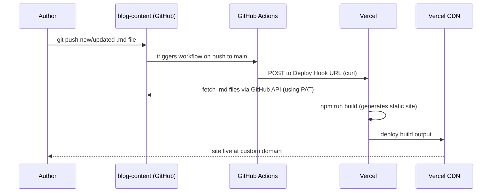
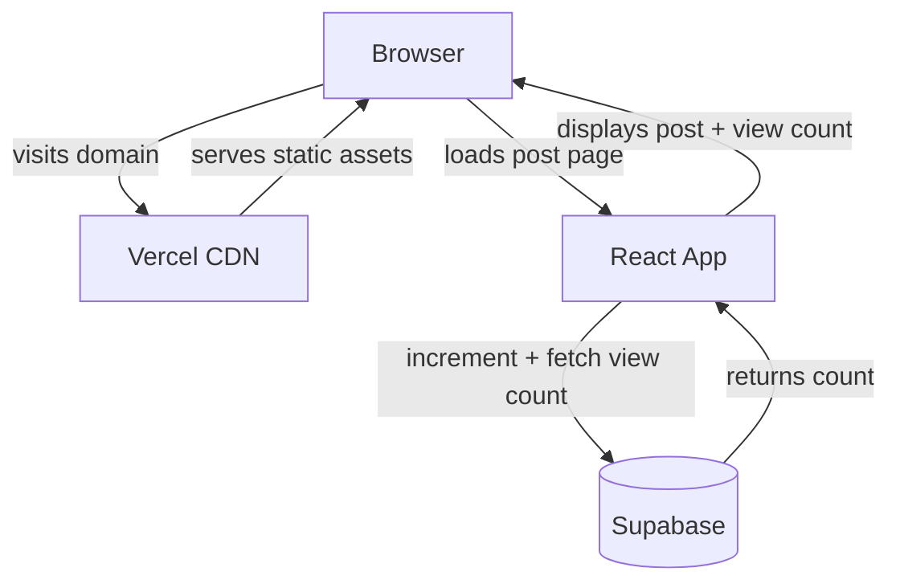
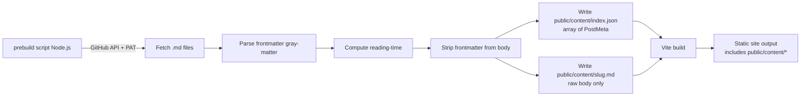

# Architecture

## Overview

A static personal blog/notes app. Content lives in a separate private GitHub repo as `.md` files. Pushing content triggers a Vercel rebuild of the React app. Page views are tracked via Supabase.

---

## Repositories

| Repo | Visibility | Purpose |
|---|---|---|
| `AINotesTakingApp` | Private | React app source code |
| `blog-content` | Private | Markdown post files only |

Keeping content separate means you can push posts without touching the app code, and the app repo stays clean.

---

## Deployment Pipeline



---

## Runtime Architecture



---

## Content Build Flow

At build time, a `prebuild` script runs before Vite builds the app. **Important:** `gray-matter` and `reading-time` are Node.js-only — all parsing happens in the prebuild script, never in the browser. The React app only calls `fetch()` at runtime.



At runtime, React fetches `/content/index.json` (post list) and `/content/{slug}.md` (post body). No Node.js libraries run in the browser.

If `CONTENT_REPO_TOKEN` is not set (local dev), the script skips the fetch and reuses existing files in `public/content/`.

---

## Project Structure

```
AINotesTakingApp/
├── src/
│   ├── components/
│   │   ├── Layout/
│   │   │   ├── Header.tsx
│   │   │   └── Footer.tsx
│   │   ├── Blog/
│   │   │   ├── PostCard.tsx       # card on listing page
│   │   │   ├── PostList.tsx       # grid/list of PostCards
│   │   │   └── PostContent.tsx    # renders MD with react-markdown
│   │   └── ui/
│   │       ├── Tag.tsx
│   │       └── ViewCount.tsx
│   ├── pages/
│   │   ├── Home.tsx               # post listing + search/filter
│   │   ├── Post.tsx               # single post view
│   │   └── NotFound.tsx
│   ├── lib/
│   │   ├── supabase.ts            # supabase client
│   │   ├── posts.ts               # load + parse post index at runtime
│   │   └── utils.ts
│   ├── types/
│   │   └── post.ts                # Post, PostMeta interfaces
│   ├── App.tsx
│   └── main.tsx
├── scripts/
│   ├── fetch-content.ts           # prebuild: fetches .md, writes to public/content/
│   └── add-frontmatter.ts         # CLI: adds frontmatter to exported Claude .md files
├── public/
│   └── content/                   # generated at build time, served as static files
│       ├── index.json             # array of PostMeta (all published posts)
│       └── {slug}.md              # raw post body (frontmatter stripped)
├── public/
├── docs/
│   ├── ARCHITECTURE.md            # this file
│   └── TASKS.md                   # progress tracker
├── CLAUDE.md
├── package.json
├── vite.config.ts
├── tailwind.config.ts
└── tsconfig.json
```

---

## Content Repo Structure

```
blog-content/
├── posts/
│   ├── 2025-03-20-first-post.md
│   ├── 2025-03-24-building-ci-pipeline.md
│   └── ...
├── .github/
│   └── workflows/
│       └── trigger-deploy.yml     # fires Vercel deploy hook on push
└── README.md
```

---

## MD File Format

Every post must have this frontmatter:

```yaml
---
title: "Building a CI Pipeline with Claude"
date: 2025-03-24
description: "What I learned exporting Claude Code sessions to blog posts"
tags: [claude, devops, ci]
draft: false
---

Post content starts here...
```

- `slug` is derived from the filename (e.g. `2025-03-20-first-post.md` → `/posts/first-post`)
- `readingTime` is computed from content length at build time
- `draft: true` posts are excluded from the build

---

## Data Models

### TypeScript — `src/types/post.ts`

```typescript
export interface PostMeta {
  slug: string;
  title: string;
  date: string;         // ISO date string
  description: string;
  tags: string[];
  readingTime: number;  // minutes, computed at build time
  draft: boolean;
}

export interface Post extends PostMeta {
  content: string;      // raw markdown
}
```

### Supabase — `page_views` table

```sql
create table page_views (
  slug         text primary key,
  count        integer not null default 0,
  last_viewed  timestamptz default now()
);

-- Atomic increment RPC — avoids race conditions from concurrent visitors
create or replace function increment_view(post_slug text)
returns void as $$
  insert into page_views (slug, count, last_viewed)
  values (post_slug, 1, now())
  on conflict (slug) do update
  set count = page_views.count + 1,
      last_viewed = now();
$$ language sql;

-- RLS
alter table page_views enable row level security;
create policy "allow_read"   on page_views for select using (true);
create policy "allow_insert" on page_views for insert with check (true);
create policy "allow_update" on page_views for update using (true);
```

Client calls `supabase.rpc('increment_view', { post_slug: slug })` — one atomic operation, no read-modify-write race.

View deduplication: `sessionStorage` key `viewed:{slug}` prevents re-counting on page refresh within the same browser session.

---

## Environment Variables

### Vercel (app build + runtime)

| Variable | Purpose |
|---|---|
| `CONTENT_REPO_TOKEN` | GitHub PAT with `contents:read` on `blog-content` repo |
| `CONTENT_REPO_OWNER` | GitHub username/org |
| `CONTENT_REPO_NAME` | Name of content repo (e.g. `blog-content`) |
| `VITE_SUPABASE_URL` | Supabase project URL |
| `VITE_SUPABASE_ANON_KEY` | Supabase anon key (safe to expose, RLS protects data) |

### Content repo GitHub Secrets

| Secret | Purpose |
|---|---|
| `VERCEL_DEPLOY_HOOK_URL` | Vercel deploy hook URL, triggered on push |

---

## GitHub Action — Content Repo

`.github/workflows/trigger-deploy.yml` in `blog-content`:

```yaml
name: Trigger Vercel Deploy

on:
  push:
    branches: [main]
    paths:
      - 'posts/**'

jobs:
  deploy:
    runs-on: ubuntu-latest
    steps:
      - name: Trigger Vercel rebuild
        run: curl -X POST "${{ secrets.VERCEL_DEPLOY_HOOK_URL }}"
```

---

## Tech Stack Decisions

| Concern | Choice | Rationale |
|---|---|---|
| Frontend | Vite + React + TypeScript | Fast builds, strong typing |
| Styling | Tailwind CSS | Blog layouts need minimal custom CSS |
| MD rendering | react-markdown + remark-gfm | Full GFM support, extensible |
| Frontmatter | gray-matter | De-facto standard |
| Read time | reading-time | Single utility, accurate |
| Routing | React Router v6 | Simple slug-based routing |
| Page views | Supabase | Free tier, no server needed, real-time capable |
| Hosting | Vercel | Works with private repos, auto CI/CD, free custom domain |
| Build trigger | Vercel Deploy Hook | One `curl` command, no complex setup |
